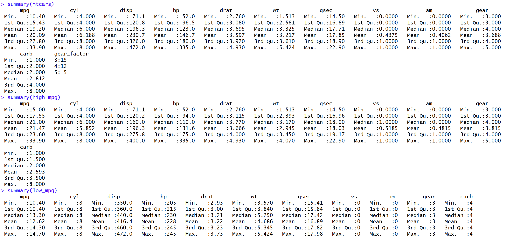
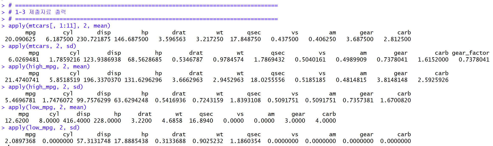
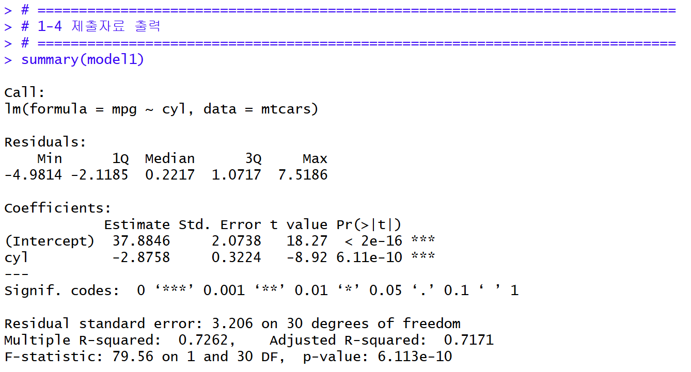
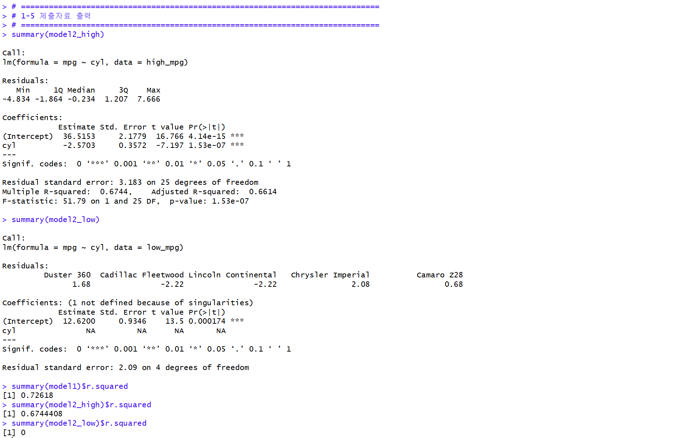
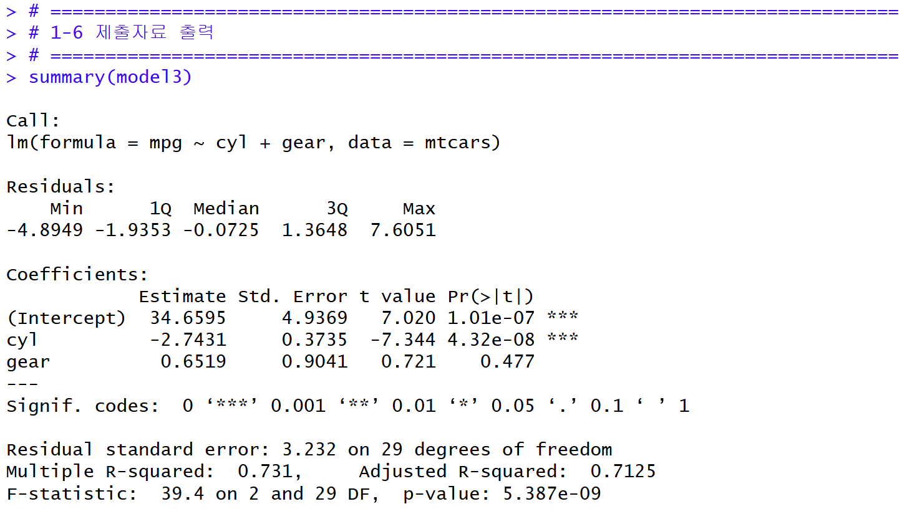
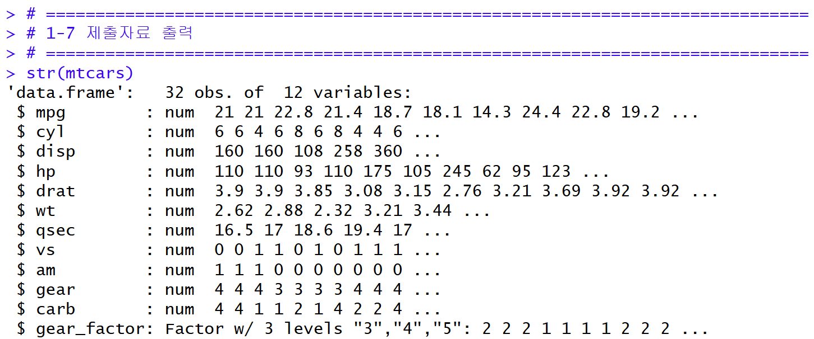
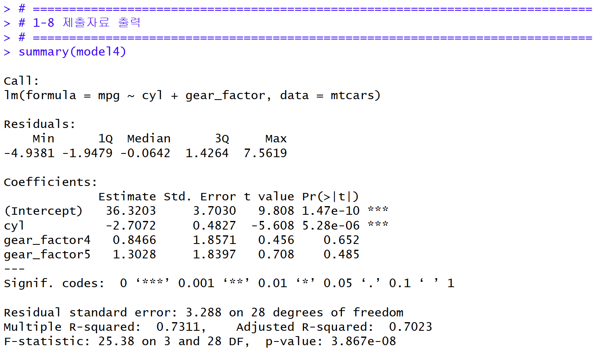
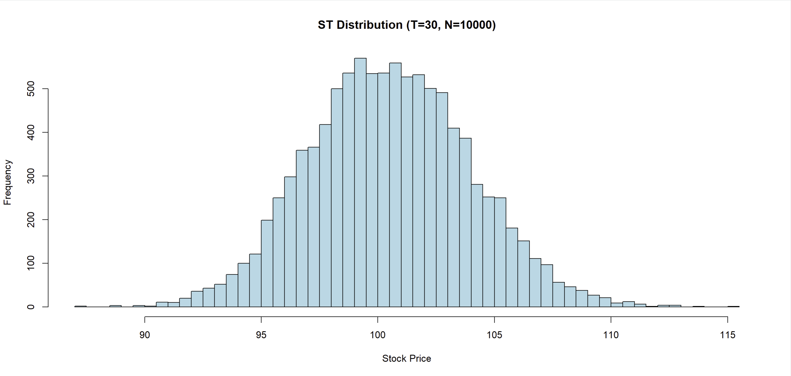

# R-Py 컴퓨팅: Homework 2

## PART1. mtcars 데이터에 대한 dplyr 및 Linear Regression

### 1-2 요약 통계량
원래 mtcars 데이터와 high_mpg, low_mpg 그룹에 대해 summary 함수를 사용하여 요약 통계량을 구하였습니다.

---

### 1-3 Apply 함수를 사용한 평균과 표준편차
mtcars, high_mpg, low_mpg 세 데이터에 대하여 모든 변수에 대한 평균과 표준편차를 구하였습니다.

**평균값 비교 결과:** apply 함수로 구한 평균값과 2번 summary 함수의 Mean 값은 동일합니다.

예시로 mtcars의 mpg 비교:
- summary(mtcars)의 Mean: 20.09
- apply(mtcars[, 1:11], 2, mean)의 mpg: 20.090625

---

### 1-4 선형 회귀 모형 (mpg ~ cyl)
mpg를 target 변수로, cylinder를 feature로 하는 선형 회귀 모형을 추정하였습니다.

---

### 1-5 high_mpg, low_mpg 선형 회귀 및 R² 비교
4번의 작업을 high_mpg, low_mpg 데이터 프레임에 적용하였습니다.

**R² 비교:**
- mtcars: 0.7262
- high_mpg: 0.6744
- low_mpg: 0

**결론:** mtcars가 R² 기준으로 예측력이 가장 좋습니다.

---

### 1-6 선형 회귀 모형 (mpg ~ cyl + gear)
mpg를 target 변수로, cylinder 및 gear를 feature로 하는 선형 회귀 모형을 추정하였습니다.

---

### 1-7 gear_factor 변수 생성
Mutate와 as.factor를 사용해서 gear_factor 변수를 생성하고, str 명령어로 팩터형 변수로 정의되었는지 확인하였습니다.

---

### 1-8 선형 회귀 모형 (mpg ~ cyl + gear_factor)
mpg를 target 변수로, cylinder 및 gear_factor를 feature로 하는 선형 회귀 모형을 추정하였습니다.

**6번과의 차이점:** 수치형은 선형 관계를 가정하고 계수 1개로 추정하지만, 팩터형은 기준 수준(gear=3) 대비 각 수준별 효과를 더미변수로 따로 추정합니다.

---

## PART2. 시뮬레이션 기법의 활용

기하 브라운 운동을 활용하여 S0=100, T=30, σ=0.1, rf=0.04 조건에서 10,000개의 주가 경로 시나리오를 생성하였습니다.

**결과:**
- ST 평균: 100.5158
- ST 분산: 11.9474